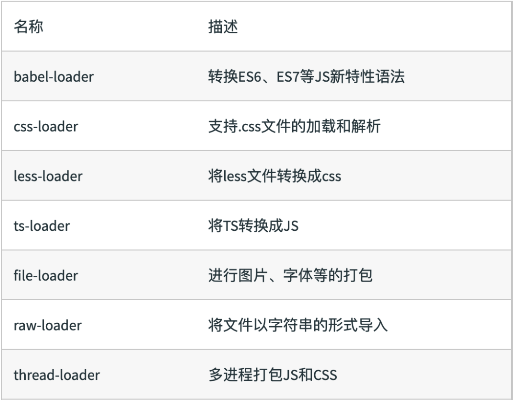
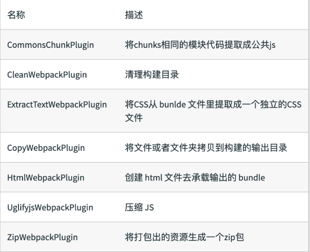
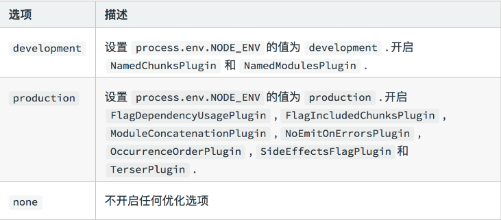

# webpack-triumph

webpack的学习总结记录

## 摘要

webpack的默认配置文件是webpack.config.js

可通过webpack --config指定配置文件

开发环境一般设置为webpack.config.dev.js

生产环境一般设置为webpack.config.pro.js

## 零配置的的默认webpack的配置文件

```js
module.export = {
    entry:'./src/index.js',
    output:'./dist/main.js'
}
```

## 环境搭建Node.js和NPM（自行安装，可百度）

### 初始化 webpack

`npm init -y`即可初始化 webpack 生成 package.json

`-y`会默认初始化配置为yes

### 安装 webpack 以及 webpack-cli

`npm i webpack webpack-cli --save-dev`

### 检查是否安装

`./node_modules/.bin/webpack -v`

### 简单例子展示webpack的使用

```js
// webpack 脚本(webpack.config.js)
const path = require('path');
module.export = {
    mode: 'production',
    entry:'./src/index.js',
    output:{
        path: path.resolve(__dirname,'dist'),
        filename:'bundle.js'
    }
}
// src 文件夹下创建 index.js 文件并随意输出(入口文件)
document.write('hello world');

// 运行打包在终端执行
./node_modules/.bin/webpack

// 构建结果(自动生成dist/bundle.js文件)

// 手动创建html文件并引入 bundle.js 文件即可打开 html 文件
<!DOCTYPE html>
<html lang="en">
<head>
    <meta charset="UTF-8">
    <meta name="viewport" content="width=device-width, initial-scale=1.0">
    <title>Document</title>
</head>
<body>
    <script src="dist/bundle.js"></script>
</body>
</html>
```

通过例子发现打包命令`./node_modules/.bin/webpack`很复杂，

我们安装依赖后，如果依赖存在命令的话，会在`./node_modules/.bin`目录下创建软链接

`package.json`文件可默认读取到`./node_modules/.bin`目录下的命令

所以在`package.json`文件下配置script即可指定任意软链接

```js
// package.json
{
  "scripts": {
    "build": "webpack"
  }
}
```

删除已经打包好的dist目录`rm -rf dist`重新执行`npm run build`即可再次完成运行打包

### 自动清理打包目录（不用手动`rm -rf dist`）

`npm i clean-webpack-plugin -D`

```js
const { CleanWebpackPlugin } = require("clean-webpack-plugin");
module.exports = {
  plugins: [
    new CleanWebpackPlugin() // 打包前清空dist目录
  ]
};
```

## webpack核心概念的基础用法

### entry入口文件配置

```js
// 单入口文件
module.export = {
    entry:'./src/index.js',
}
// 多入口文件
module.export = {
    entry:{
        app: './src/app.js',
        adminApp:'./src/adminApp.js'
    }
}
```

### outPut出口文件

outPut是告诉webpack如何将编译后的文件输出到磁盘

```js
module.export = {
    output:{
        path: path.resolve(__dirname,'dist'),
        filename:'[name].js'
    }
}
```

### loader



使用方法

```js
// test 指代匹配规则 use 指定使用 loader 名称
module.export = {
    module: {
        rules: [
            {
                test: /\.js|jsx$/,
                use: 'babel-loader',
            },
            {
                test: /\.css$/,
                use: [
                'style-loader',
                { loader: 'css-loader' },
                ]
            },
        ],
    },
}
```

### plugins

主要是增强webpack的功能



使用方法

```js
module.exports = {
  plugins: [
    new CleanWebpackPlugin(), // 打包前清空dist目录
  ]
};
```

## mode

mode用来指定当前的构造环境:production、development、none

设置mode可以使用webpack内置的函数，默认为production

mode的内置函数功能



## 123

### 解析 ES6

使用`babel-loader`

`npm i @babel/core @babel/preset-env babel-loader --save-dev`

babel的配置文件是.babelrc

```js
{
    "presets": [
        "@babel/preset-env", // 解析 ES6
    ]
}
```

### 解析 jsx

 安装 react 以及 react 的 babel

`npm i react react-dom @babel/preset-react -D`

修改配置文件.babelrc

```js
{
    "presets": [
        "@babel/preset-react" //增加 react 的 babel preset 配置
    ]
}
```

配置webpack的loader

```js
module.exports = {
    module: {
        rules: [
            {
                test: /\.js|jsx$/,
                use: 'babel-loader',
            }
        ],
    },
}

```

### 解析css

css-loader用于加载.css文件，并且转换为commonjs对象

style-loader将样式通过`<style>`标签插入到head中

`npm i style-loader css-loader -D`

```js
module.exports = {
    module: {
        rules: [
            {
                test: /\.css$/,
                use: [
                    'style-loader',
                    { loader: 'css-loader' },
                ]
            }
        ],
    },
}

```

### 解析less

less-loader用于将less转换为css

`npm i less less-loader -D`

```js
module.exports = {
    module: {
        rules: [
            {
                test: /\.css$/,
                use: [
                    'style-loader',
                    { loader: 'css-loader' },
                ]
            },
            {
                test: /\.less$/,
                use: [
                    'style-loader',
                    { loader: 'css-loader' },
                    { loader: 'less-loader' },
                ]
            },
        ],
    },
}

```

### 解析图片和字体

file-loader用于处理文件

```js
module.exports = {
    module: {
        rules: [
            {
                test: /\.(ico|png|jpg|jpeg|mp4|mp3|gif|mov)$/,
                use: 'file-loader'
            },
        ],
    },
}
```

url-loader也可以处理图片和字体，可以设置更小的资源自动base64

```js
module.exports = {
    module: {
        rules: [
            {
                test: /\.(ico|png|jpg|jpeg|mp4|mp3|gif|mov)$/,
                use: [
                    {
                        loader: 'url-loader',
                        options: {
                        limit: 8192, // 限制字节（如果图片或者字体的字节数小于此数值，自动转换为base64）
                        },
                    },
                ],
            },
        ],
    },
}
```

### 文件监听(浏览器不会自动刷新)（两种方式）(不常用)

在 package.json 文件中的 script 中添加：`"watch": "webpack --watch"`

在配置 webpack.config.js 文件中设置`watch: true`

### webpack 热更新 webpack-dev-server

WDS（webpack-dev-server）不刷新浏览器，不输出文件，而是放在内存中

```js
// 前提安装webpack以及webpack-cli `npm i webpack webpack-cli --save-dev`
const webpack = require("webpack");
module.exports = {
  plugins: [new webpack.HotModuleReplacementPlugin()],
  devServer: {
    contentBase: "./dist",
    hot: true
  }
};
```

### 文件指纹（版本管理，更新迭代）

js 文件使用 chunkhash css 文件使用 contenthash

hash: 如果都使用 hash 的话，因为这是工程级别的，即每次修改任何一个文件，所有文件名的 hash 至都将改变。所以一旦修改了任何一个文件，整个项目的文件缓存都将失效。

chunkhash: chunkhash 根据不同的入口文件(Entry)进行依赖文件解析、构建对应的 chunk，生成对应的哈希值。在生产环境里把一些公共库和程序入口文件区分开，单独打包构建，接着我们采用 chunkhash 的方式生成哈希值，那么只要我们不改动公共库的代码，就可以保证其哈希值不会受影响。

contenthash: contenthash 是针对文件内容级别的，只有你自己模块的内容变了，那么 hash 值才改变。

注意：chunkhash 和热更新存在冲突。所以一般生产环境不使用热更新。chunkhash 用于生产环境

```js
//设置MiniCssExtractPlugin的filename使用[contenthash]
//MiniCssExtractPlugin和style-loader不能共用，需要替换`style-loader`=`MiniCssExtractPlugin.loader`
module.exports = {
  entry: { index: "./src/index.js", app: "./src/app.js" },
  // js文件指纹设置
  output: {
    path: path.join(__dirname, "dist"),
    filename: "[name]_[chunkhash:8].js"
  },
  // css文件指纹设置
  plugins: [
    new MiniCssExtractPlugin({
      filename: "[name]_[contenthash:8].css"
    })
  ]
};
```

```js
// 图片文件指纹
module.exports = {
    module: {
        rules: [
            {
                test: /\.(ico|png|jpg|jpeg|mp4|mp3|gif|mov)$/,
                use: [
                    {
                        loader: 'url-loader',
                        options: {
                        limit: 8192, // 限制字节（如果图片或者字体的字节数小于此数值，自动转换为base64）
                        name:'[name]_[hash:8].[ext]'
                        },
                    },
                ],
            },
        ],
    },
}
```

### 代码压缩（html 压缩、css 压缩、js 压缩）

js 文件压缩默认内置了 uglifyjs-webpack-plugin

css 压缩：optimize-css-assets-webpack-plugin 需要安装预处理器 cssanano

html 压缩： html-webpack-plugin,设置压缩参数

```js
// css压缩
const optimizeCssAssetsWebpackPlugin = require("optimize-css-assets-webpack-plugin");
module.exports = {
  plugins: [
    new optimizeCssAssetsWebpackPlugin({
      assetNameRegExp: /\.css$/g,
      cssProcessor: require("cssnano")
    })
  ]
};
//html压缩
const MiniCssExtractPlugin = require("mini-css-extract-plugin");
module.exports = {
  plugins: [
    new HtmlWebpackPlugin({
      // favicon: './favicon.ico',
      template: "index.html",
      filename: "index.html",
      inject: true,
      hash: false,
      chunks: ["index"],
      minify: {
        // 压缩HTML文件
        html5: true,
        collapseWhitespace: true, //删除空白符
        preserveLineBreaks: false,
        minifyCSS: true, // 压缩内联css
        minifyJS: true,
        removeComments: false //移除注释
      }
    })
  ]
};
```

## 456

### 资源内联

资源内联的意义：页面框架的初始化脚本、上报相关打点、css 内联避免样式闪烁、减少 http 网络请求次数

使用 raw-loader `npm i raw-loader@0.5.1 -D`

直接在 html 文件中引入：

```js
<head>
  ${require("raw-loader!./meta.html")}
  <title>Document</title>
</head>
```

css内联方案一： 借助style-loader

```js
module.exports = {
    module: {
        rules: [
            {
                test: /\.css$/,
                use: [
                    'style-loader',
                    { loader: 'css-loader' },
                ]
            },
            {
                test: /\.less$/,
                use: [
                    {
                        loader:'style-loader',
                        options:{
                            insertAt: 'top',// 样式插入到<head>
                            singleon:true, // 将所有style标签合为1个
                        }
                    },
                    { loader: 'css-loader' },
                    { loader: 'less-loader' },
                ]
            },
        ],
    },
}

```

css内联方案二： html-inline-css-webpack-plugin

此方式需结合css文件指纹共同使用生效

```js
const HTMLInlineCSSWebpackPlugin = require("html-inline-css-webpack-plugin").default;
module.exports = {
  plugins: [
    new HTMLInlineCSSWebpackPlugin(),
  ],
}
```

### 多页面打包

思路：动态获取entry和设置html-webpack-plugin数量

利用glob插件取得所有的入口文件`glob.sync(path.join(__dirname, "./src/*/index.js"))`

`cnpm i glob -D`

```js
// 多页面打包封装入口函数setMPA.js
const HtmlWebpackPlugin = require("html-webpack-plugin");
const glob = require("glob");
const path = require('path');
const setMPA = () => {
    const entry = {};
    const htmlWebpackPlugins = [];
    const entryFiles = glob.sync(path.join(__dirname, "../src/*/index.jsx"));
    console.log(entryFiles)
    Object.keys(entryFiles).map((index) => {
        const entryFile = entryFiles[index];
        // '/Users/cpselvis/my-project/src/index/index.js'

        const match = entryFile.match(/src\/(.*)\/index\.js/);
        const pageName = match && match[1];

        entry[pageName] = entryFile;
        htmlWebpackPlugins.push(
            new HtmlWebpackPlugin({
                template: path.join(__dirname, `../src/${pageName}/index.html`),
                filename: `${pageName}.html`,
                chunks: [pageName],
                inject: true,
                minify: {
                    html5: true,
                    collapseWhitespace: true,
                    preserveLineBreaks: false,
                    minifyCSS: true,
                    minifyJS: true,
                    removeComments: false,
                }
            })
        );
    });

    return {
        entry,
        htmlWebpackPlugins,
    };
};

module.exports = setMPA;

// 在webpack.base.js中引入setMPA函数
const setMPA = require('./utils/setMPA');
const { entry, htmlWebpackPlugins } = setMPA();
module.exports = {
    entry,
    plugins: [
        new CleanWebpackPlugin()
    ].concat(htmlWebpackPlugins)
}

```

### source-map的使用

作用：通过source-map定位源代码（开发环境开启，线上环境关闭）

`devtool: 'source-map'`

### 提取页面公共资源

方法一：基础库的分离
思路：将react、react-dom基础包通过cdn引入，不打入bundle中，使用 `html-webpack-externals-plugin`

```js
const HtmlWebpackExternalsPlugins = [
  new HtmlWebpackExternalsPlugin({
    externals: [
      {
        module: "react",
        entry: "https://11.url.cn/now/lib/16.2.0/react.min.js",
        global: "React"
      },
      {
        module: "react-dom",
        entry: "https://11.url.cn/now/lib/16.2.0/react-dom.min.js",
        global: "ReactDOM"
      }
    ]
  })
];
module.exports = {
  plugins: [
    new CleanWebpackPlugin() // 打包前清空dist目录
  ]
    .concat(htmlWebpackPlugins)
    .concat(HtmlWebpackExternalsPlugins)
};
// HtmlWebpackExternalsPlugins插件必须在htmlWebpackPlugins插件后面，不然还得在模板html文件中引入cdn文件(即是HtmlWebpackExternalsPlugins中的entry文件)
```

方法二：利用 SplitChunksPlugin 进行公共脚本分离

```js
module.exports = {
  optimization: {
    // 代码分割，提取公共代码
    splitChunks: {
      cacheGroups: {
        commons: {
          test: /(react|react-dom)/,
          name: "vendors",
          chunks: "all"
        }
      }
    }
  }
};

```

方法 3：预编译资源模块

```js
// 思路：将react、react-dom、redux等基础包和业务打包成一个文件
// 方法：使用DLLPlugin进行分包，DllReferencePlugin对manifest.json引用
// 创建webpack.dll.js文件
const path = require('path');
const webpack = require('webpack');

module.exports = {
    entry: {
        library: [
            'react',
            'react-dom'
        ]
    },
    output: {
        filename: '[name]_[hash].dll.js', // 不能使用chunkhash/contenthash
        path: path.join(__dirname, 'build/library'),
        library: '[name]_[hash]' // 暴露出库的名称
    },
    plugins: [
        new webpack.DllPlugin({
            name: '[name]_[hash]',
            path: path.join(__dirname, 'build/library/[name].json')
        })
    ]
}
// 在package.json中设置
{
  "scripts": {
    "dll": "webpack --config webpack.dll.js"
  },
}
// 运行npm run dll 打包生成build文件夹及其文件

// 配置webpack.prod.js文件,通过add-asset-html-webpack-plugin插件为html自动添加文件
const AddAssetHtmlPlugin = require('add-asset-html-webpack-plugin');
module.exports = {
    plugins: [
        new webpack.DllReferencePlugin({
            manifest: require('./build/library/library.json')
        }),
        new AddAssetHtmlPlugin({
            filepath: path.resolve(__dirname, 'build/library/*.dll.js'),
        }),
    ]
};
// 最后npm run build 打包
// 三个方法比较：方法三更加推荐，主要分离基础包react、react-dom等；方法二必须还得为每个库指定CDN；
```

### tree shaking 摇树优化

摇树优化指代代码中没有用到的内容在生产环境自动删除

webpack默认支持，webpack的mode参数可配置tree shaking

```js
// 此代码永远不会执行，在生产环境会自动清除
if(false) {
    console.log(123)
}
```

### 代码分割

对于一个大型应用，把所有的代码放到一个文件显然不够有效，故webpack存在一个功能将代码库分割成hunks（语块）,代码运行到需要它们的时候才去加载

适用场景：

1. 抽离想用代码到一个共享块
2. 脚本懒加载，使得初始下载的代码更小

懒加载js脚本的方式：

1. CommonJS:require.ensure
2. ES6:动态import（目前没有原生支持，需要babel转换`cnpm install --save-dev @babel/plugin-syntax-dynamic-import`）

```js
// .babelrc文件中添加
{
    "plugins":["@babel/plugin-syntax-dynamic-import"],
}

// 举例
// Text.jsx
import React from 'react';
export default () => <div>动态importjs</div>;
// index.jsx
import React, { useState } from 'react';
import ReactDOM from 'react-dom';
import lake from './lake.jpg';

function App() {
    const [Component,setComponent] = useState(null);
    const onClick = () => {
        import('./Text.jsx').then((res) => {
            setComponent(res.default)
        })
    }
    return <div>
        {Component ? Component : null}
        
    </div>
}

ReactDOM.render(<App/>,document.getElementById('root'))
```

### webpack打包库和组件

### 优化命令行的构建日志

使用 friendly-errors-webpack-plugin: success、warning、error
`cnpm i friendly-errors-webpack-plugin -D`

```js
module.exports = {
  plugins: [
    new webpack.HotModuleReplacementPlugin(),
    new friendlyErrorsWebpackPlugin()
  ],
  devServer: {
    contentBase: "./dist",
    hot: true,
    stats: "errors-only" // 开发环境
  },
  stats: "errors-only" // 生产环境
};
```

### 构建异常和中断处理

## 构建配置抽离成npm包
